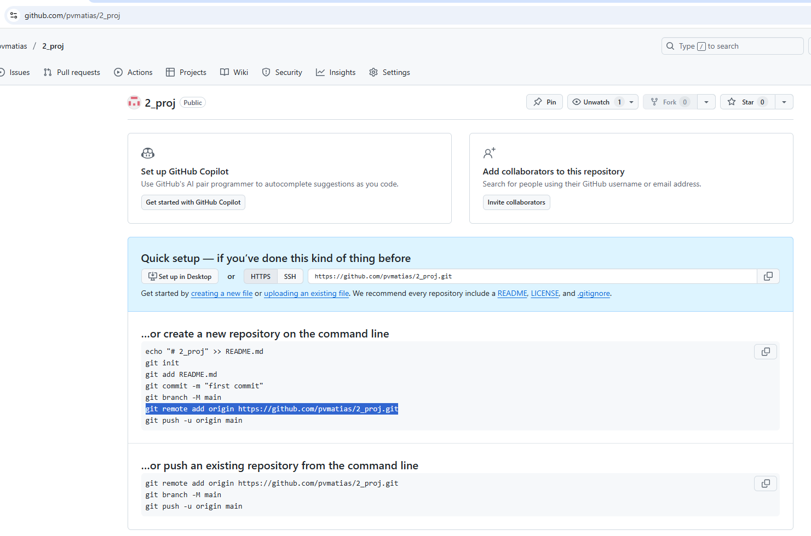
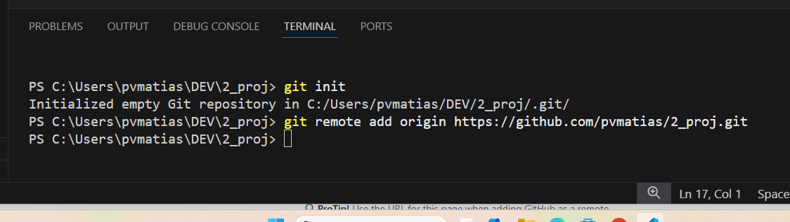

# Instruções básicas para uso do GIT

- Criar o projecto
- Inicializar o GIT com o comando: 
```
git init
```
- Criar um ou dois ficheiros no meu projecto (para ter alguma coisa)
- Utilizar o browser para visitar a plataforma de git (github)
- - Fazer login
- - Ir a "repositories"
- - Clicar em NEW
- - Copiar a frase que diz "git add remote..."


- Escrever (ou colar) o comando no terminal


- Adicionar todo o conteudo à historia do git com o comando
```
git add .
```
(*isto lê-se git add all*)


